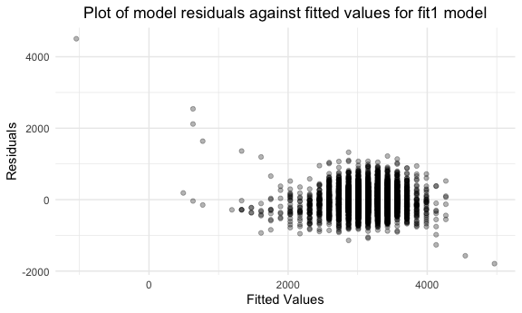

p8105\_hw6\_yj2686
================
Yiqun Jin
11/30/2021

## Problem 1

Load and clean the data for regression analysis

``` r
birthweight = read.csv("./birthweight.csv") %>% 
  mutate(babysex = factor(if_else(babysex == 1, "male", "female")),
         frace = factor(recode(frace, '1' = "White", '2' = "Black", '3' = "Asian", 
                               '4' = "Puerto Rican", '8' = "Other", '9' = "Unknown")),
         mrace = factor(recode(mrace,'1' = "White", '2' = "Black", '3' = "Asian", 
                               '4' = "Puerto Rican", '8' = "Other", '9' = "Unknown")),
         malform = factor(recode(malform, '0' = "absent", '1' = "present")))
# check for missing data
sum(is.na(birthweight))
```

    ## [1] 0

Propose a regression model for birth weight.

Since birth weight of baby is usually associated with baby’s length at
birth, I made a scatter plot of baby’s length at birth `blength`.

``` r
birthweight %>% 
  ggplot(aes(x = blength, y = bwt)) + 
  geom_point() +
  labs(title = "Scatter plot of baby's birth weight and baby's length at birth") +
  theme(plot.title = element_text(hjust = 0.5))
```


It seemed that there might be a linear relationship between baby’s
length at birth `blength` and birth weight `bwt`. Thus, I will try
`blength` as the predictor of the regression model for birth weight and
make a plot of model residuals against fitted values

``` r
fit1 = lm(bwt ~ blength, data = birthweight)
fit1 %>% 
  broom::tidy() %>% 
  knitr::kable()
```

| term        |   estimate | std.error | statistic | p.value |
|:------------|-----------:|----------:|----------:|--------:|
| (Intercept) | -3841.2667 | 95.122166 | -40.38246 |       0 |
| blength     |   139.8109 |  1.909124 |  73.23301 |       0 |

``` r
birthweight %>% 
  modelr::add_residuals(fit1) %>% 
  modelr::add_predictions(fit1) %>% 
  ggplot(aes(x = pred, y = resid)) +
  geom_point(alpha = .3) +
  labs(title = "Plot of model residuals against fitted values",
       x = "Fitted Values",
       y = "Residuals") +
  theme(plot.title = element_text(hjust = 0.5))
```



Compare your model to two others:

One using length at birth and gestational age as predictors (main
effects only) One using head circumference, length, sex, and all
interactions (including the three-way interaction) between these Make
this comparison in terms of the cross-validated prediction error; use
crossv\_mc and functions in purrr as appropriate.

``` r
fit2 = lm(bwt ~ blength + gaweeks,birthweight)
fit3 = lm(bwt ~ bhead + blength + babysex + bhead*blength + bhead*babysex + blength*babysex + bhead*blength*babysex, birthweight)

fit2 %>% 
  broom::tidy() %>% 
  knitr::kable()
```

| term        |    estimate | std.error | statistic | p.value |
|:------------|------------:|----------:|----------:|--------:|
| (Intercept) | -4347.66707 | 97.958360 | -44.38281 |       0 |
| blength     |   128.55569 |  1.989891 |  64.60439 |       0 |
| gaweeks     |    27.04673 |  1.717930 |  15.74379 |       0 |

``` r
fit3 %>% 
  broom::tidy() %>% 
  knitr::kable()
```

| term                      |     estimate |    std.error |  statistic |   p.value |
|:--------------------------|-------------:|-------------:|-----------:|----------:|
| (Intercept)               |  -801.948671 | 1102.3077046 | -0.7275180 | 0.4669480 |
| bhead                     |   -16.597546 |   34.0916082 | -0.4868514 | 0.6263883 |
| blength                   |   -21.645964 |   23.3720477 | -0.9261475 | 0.3544209 |
| babysexmale               | -6374.868351 | 1677.7669213 | -3.7996150 | 0.0001469 |
| bhead:blength             |     3.324444 |    0.7125586 |  4.6655020 | 0.0000032 |
| bhead:babysexmale         |   198.393181 |   51.0916850 |  3.8830816 | 0.0001047 |
| blength:babysexmale       |   123.772887 |   35.1185360 |  3.5244319 | 0.0004288 |
| bhead:blength:babysexmale |    -3.878053 |    1.0566296 | -3.6702106 | 0.0002453 |

## Problem 2

``` r
weather_df = 
  rnoaa::meteo_pull_monitors(
    c("USW00094728"),
    var = c("PRCP", "TMIN", "TMAX"), 
    date_min = "2017-01-01",
    date_max = "2017-12-31") %>%
  mutate(
    name = recode(id, USW00094728 = "CentralPark_NY"),
    tmin = tmin / 10,
    tmax = tmax / 10) %>%
  select(name, id, everything())
```

    ## Registered S3 method overwritten by 'hoardr':
    ##   method           from
    ##   print.cache_info httr

    ## using cached file: ~/Library/Caches/R/noaa_ghcnd/USW00094728.dly

    ## date created (size, mb): 2021-10-05 16:32:44 (7.602)

    ## file min/max dates: 1869-01-01 / 2021-10-31

Bootstrapping

``` r
bootstrap = 
  weather_df %>% 
  modelr::bootstrap(n = 5000, id = "strap_id") %>% 
  mutate(
    strap = map(strap, as_tibble),
    models = map(strap, ~lm(tmax ~ tmin, data = .x)),
    results = map(models, broom::tidy),
    summary = map(models, broom::glance)
  ) %>% 
  unnest(c(results, summary), names_repair = "universal")
```

    ## New names:
    ## * statistic -> statistic...7
    ## * p.value -> p.value...8
    ## * statistic -> statistic...12
    ## * p.value -> p.value...13
