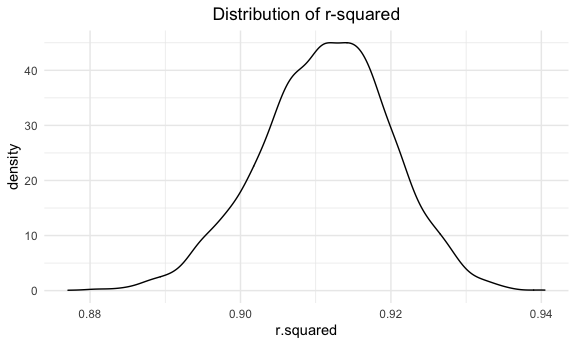

p8105\_hw6\_yj2686
================
Yiqun Jin
11/30/2021

## Problem 1

### Load and clean the data for regression analysis

``` r
birthweight = read.csv("./birthweight.csv") %>% 
  mutate(babysex = factor(if_else(babysex == 1, "male", "female")),
         frace = factor(recode(frace, '1' = "White", '2' = "Black", '3' = "Asian", 
                               '4' = "Puerto Rican", '8' = "Other", '9' = "Unknown")),
         mrace = factor(recode(mrace,'1' = "White", '2' = "Black", '3' = "Asian", 
                               '4' = "Puerto Rican", '8' = "Other", '9' = "Unknown")),
         malform = factor(recode(malform, '0' = "absent", '1' = "present")))
# check for missing data
sum(is.na(birthweight))
```

    ## [1] 0

### Propose a regression model for birth weight

Since birth weight of baby is usually associated with baby’s length at
birth, I made a scatter plot of baby’s length at birth `blength`.

``` r
birthweight %>% 
  ggplot(aes(x = blength, y = bwt)) + 
  geom_point(alpha = .5) +
  labs(title = "Scatter plot of baby's birth weight and baby's birth length") +
  theme(plot.title = element_text(hjust = 0.5))
```


According to the scatter plot, it seemed that there might be a linear
relationship between baby’s length at birth `blength` and birth weight
`bwt`. Thus, I will try `blength` as the predictor of the regression
model for birth weight and make a plot of model residuals against fitted
values

``` r
fit1 = lm(bwt ~ blength, data = birthweight)
fit1 %>% 
  broom::tidy() %>% 
  knitr::kable()
```

| term        |   estimate | std.error | statistic | p.value |
|:------------|-----------:|----------:|----------:|--------:|
| (Intercept) | -3841.2667 | 95.122166 | -40.38246 |       0 |
| blength     |   139.8109 |  1.909124 |  73.23301 |       0 |

``` r
birthweight %>% 
  modelr::add_residuals(fit1) %>% 
  modelr::add_predictions(fit1) %>% 
  ggplot(aes(x = pred, y = resid)) +
  geom_point(alpha = .3) +
  labs(title = "Plot of model residuals against fitted values for fit1 model",
       x = "Fitted Values",
       y = "Residuals") +
  theme(plot.title = element_text(hjust = 0.5))
```


### Compare your model to two others

fit2: Using length at birth and gestational age as predictors (main
effects only) fit3: Using head circumference, length, sex, and all
interactions (including the three-way interaction) between these as
predictors

``` r
fit2 = lm(bwt ~ blength + gaweeks,birthweight)

fit2 %>% 
  broom::tidy() %>% 
  knitr::kable()
```

| term        |    estimate | std.error | statistic | p.value |
|:------------|------------:|----------:|----------:|--------:|
| (Intercept) | -4347.66707 | 97.958360 | -44.38281 |       0 |
| blength     |   128.55569 |  1.989891 |  64.60439 |       0 |
| gaweeks     |    27.04673 |  1.717930 |  15.74379 |       0 |

``` r
birthweight %>% 
  modelr::add_residuals(fit2) %>% 
  modelr::add_predictions(fit2) %>% 
  ggplot(aes(x = pred, y = resid)) +
  geom_point(alpha = .3) +
  labs(title = "Plot of model residuals against fitted values for fit2 model",
       x = "Fitted Values",
       y = "Residuals") +
  theme(plot.title = element_text(hjust = 0.5))
```


``` r
fit3 = lm(bwt ~ bhead + blength + babysex + bhead*blength + bhead*babysex + blength*babysex + bhead*blength*babysex, birthweight)

fit3 %>% 
  broom::tidy() %>% 
  knitr::kable()
```

| term                      |     estimate |    std.error |  statistic |   p.value |
|:--------------------------|-------------:|-------------:|-----------:|----------:|
| (Intercept)               |  -801.948671 | 1102.3077046 | -0.7275180 | 0.4669480 |
| bhead                     |   -16.597546 |   34.0916082 | -0.4868514 | 0.6263883 |
| blength                   |   -21.645964 |   23.3720477 | -0.9261475 | 0.3544209 |
| babysexmale               | -6374.868351 | 1677.7669213 | -3.7996150 | 0.0001469 |
| bhead:blength             |     3.324444 |    0.7125586 |  4.6655020 | 0.0000032 |
| bhead:babysexmale         |   198.393181 |   51.0916850 |  3.8830816 | 0.0001047 |
| blength:babysexmale       |   123.772887 |   35.1185360 |  3.5244319 | 0.0004288 |
| bhead:blength:babysexmale |    -3.878053 |    1.0566296 | -3.6702106 | 0.0002453 |

``` r
birthweight %>% 
  modelr::add_residuals(fit3) %>% 
  modelr::add_predictions(fit3) %>% 
  ggplot(aes(x = pred, y = resid)) +
  geom_point(alpha = .3) +
  labs(title = "Plot of model residuals against fitted values for fit3 model",
       x = "Fitted Values",
       y = "Residuals") +
  theme(plot.title = element_text(hjust = 0.5))
```


### Make this comparison in terms of the cross-validated prediction error

``` r
cv_df = 
  crossv_mc(birthweight, 100) %>% 
  mutate(
    train = map(train, as_tibble),
    test = map(test, as_tibble)
  ) %>% 
  mutate(
    fit1_mod = map(train, ~lm(bwt ~ blength, data = birthweight)),
    fit2_mod = map(train, ~lm(bwt ~ blength + gaweeks,birthweight)),
    fit3_mod = map(train, ~lm(bwt ~ bhead + blength + babysex + bhead*blength + bhead*babysex +       blength*babysex + bhead*blength*babysex, birthweight))
  ) %>% 
  mutate(
    rmse_fit1 = map2_dbl(fit1_mod, test, ~rmse(model = .x, data = .y)),
    rmse_fit2 = map2_dbl(fit2_mod, test, ~rmse(model = .x, data = .y)),
    rmse_fit3 = map2_dbl(fit3_mod, test, ~rmse(model = .x, data = .y))
  )
  
cv_df %>% 
  select(starts_with("rmse")) %>% 
  pivot_longer(
    everything(),
    names_to = "model", 
    values_to = "rmse",
    names_prefix = "rmse_") %>% 
  mutate(model = fct_inorder(model)) %>% 
  ggplot(aes(x = model, y = rmse)) + geom_violin() +
  labs(
    title = "distribution of RMSE values for three candidate model",
    y = "Root-mean-square-deviation"
  ) +
  theme(plot.title = element_text(hjust = 0.5))
```


According to the distribution of RMSE, fit3 model have the lowest RMSE
value and the distribution is more centered, meaning that fit3 would be
the most optimal model among three candidate models

## Problem 2

### Load 2017 Central Park weather data

``` r
weather_df = 
  rnoaa::meteo_pull_monitors(
    c("USW00094728"),
    var = c("PRCP", "TMIN", "TMAX"), 
    date_min = "2017-01-01",
    date_max = "2017-12-31") %>%
  mutate(
    name = recode(id, USW00094728 = "CentralPark_NY"),
    tmin = tmin / 10,
    tmax = tmax / 10) %>%
  select(name, id, everything())
```

    ## Registered S3 method overwritten by 'hoardr':
    ##   method           from
    ##   print.cache_info httr

    ## using cached file: ~/Library/Caches/R/noaa_ghcnd/USW00094728.dly

    ## date created (size, mb): 2021-10-05 16:32:44 (7.602)

    ## file min/max dates: 1869-01-01 / 2021-10-31

### Bootstrapping and plot the distribution of estimates

``` r
bootstrap = 
  weather_df %>% 
  modelr::bootstrap(n = 5000, id = "strap_number") %>% 
  mutate(
    models = map(strap, ~lm(tmax ~ tmin, data = .x)),
    results1 = map(models, broom::glance),
    results2 = map(models, broom::tidy)
  ) 
```

For *r̂*<sup>2</sup>

``` r
r_squared = bootstrap %>% 
  unnest(results1) %>% 
  select(r.squared)
  
r_squared %>% 
  ggplot(aes(x = r.squared)) +
  geom_density() +
  labs(
    title = "Distribution of r-squared"
  ) +
  theme(plot.title = element_text(hjust = 0.5))
```



``` r
r_squared %>% 
  summarize(
    ci_lower = quantile(r.squared, 0.025),
    ci_upper = quantile(r.squared, 0.975)
  ) %>% 
  knitr::kable()
```

| ci\_lower | ci\_upper |
|----------:|----------:|
| 0.8936977 | 0.9274807 |

For $log(\\hat{\\beta\_0} \* \\hat{\\beta\_1})$

``` r
logbeta = bootstrap %>% 
  unnest(results2) %>% 
  select(strap_number, term, estimate) %>% 
  pivot_wider(
    names_from = term,
    values_from = estimate
  ) %>% 
  janitor::clean_names() %>% 
  mutate(
    log_beta = log(intercept * tmin)
  )

logbeta %>% 
  ggplot(aes(log_beta)) +
  geom_density() +
  labs(
    title = "Distribution of log(beta0 * beta1)"
  ) +
  theme(plot.title = element_text(hjust = 0.5))
```


``` r
logbeta %>% 
  summarize(
    ci_lower = quantile(log_beta, 0.025),
    ci_upper = quantile(log_beta, 0.975)
  ) %>% 
  knitr::kable()
```

| ci\_lower | ci\_upper |
|----------:|----------:|
|  1.966942 |  2.058528 |
